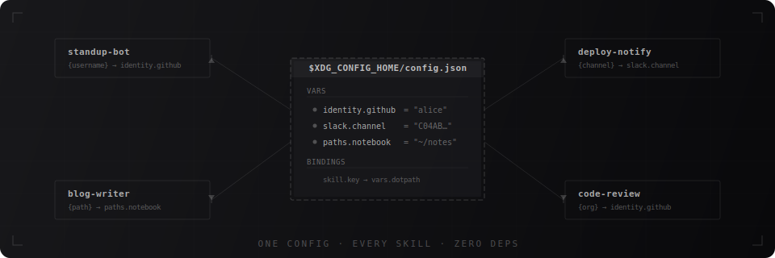

<div align="center">

# skillctx

**Portable config for agent skills — for Skill creators and users alike.**

[](https://github.com/jackchuka/skillctx/actions/workflows/ci.yml)
[](https://www.python.org)
[](LICENSE)
[](https://github.com/jackchuka/skillctx)

<br>



</div>

## The Problem

Agent skills are personal by default. A skill that posts your standup, manages your todos, or deploys your app is wired to **your** usernames, paths, Slack channel IDs, and API endpoints. It works perfectly — on your machine.

The moment you share it, it breaks. The next person has to dig through your SKILL.md, find every hardcoded value, and manually swap them out. Multiply that across ten skills and it's no longer "install and use" — it's "install and debug."

**For creators**, this means your skills aren't truly portable. You can publish them, but every user has to reverse-engineer your personal config.

**For users**, this means every new skill is a setup chore — hunting through files for values that need changing before anything works.

## The Solution

```diff
 # SKILL.md (daily-standup)
- Post standup for alice in Slack (CABC123DEF) channel
- Save memo to ~/notes
+ Post standup for {username} in Slack ({channel_id}) channel
+ Save memo to {notebook_path}
```

Hardcoded values become `{placeholders}`, resolved at runtime from one shared config (`~/.config/skillctx/config.json`).

**For creators**: one command migrates your skill. No manual find-and-replace, no template syntax to learn.

**For users**: install a skill and run it. On first use you're prompted for missing values — fill them in once and every skill that needs them picks them up automatically. No config files to hunt down, no per-skill setup.

## For Skill Creators

**One command to migrate.** That's it.

```bash
npx skills add jackchuka/skillctx   # install skillctx
/skillctx-ify my-skill              # migrate your skill — done
```

skillctx scans your skill for hardcoded values, replaces them with placeholders, and embeds a tiny zero-dep resolver. Your skill is now **portable**.

Once in a while, when skillctx itself is updated, one more command propagates changes to all your migrated skills:

```bash
/skillctx-sync
```

### How It Works

| Phase           | What happens                                         | How                         |
| :-------------- | :--------------------------------------------------- | :-------------------------- |
| **1. Scan**     | Find hardcoded values (usernames, paths, IDs)        | Deterministic via `scan.py` |
| **2. Classify** | Decide which values to extract                       | LLM-assisted judgment       |
| **3. Rewrite**  | Replace values with `{placeholders}`, embed resolver | Automated                   |

The embedded `resolve.py` is zero-dep (Python 3.10+ stdlib only) — nothing to install, works anywhere Python runs.

## For Skill Users

**Zero setup.** Install a migrated skill and use it — just like any other skill.

```bash
npx skills add creator/my-skill   # install as usual
/my-skill                         # use it — that's it
```

On first run, the embedded resolver prompts you for any missing values:

```
> /my-skill

Missing config values for "my-skill":
  username: <your GitHub username>
  notebook_path: <path to your notes directory>
```

Fill them in once and every skill that needs them picks them up automatically.

## Config Format

```json
// ~/.config/skillctx/config.json
{
  "vars": {
    "identity": {
      "github_username": "alice",
      "email": "alice@acme.io"
    },
    "slack": {
      "standup_channel_id": "CABC123DEF"
    },
    "paths": {
      "notebook": "~/notes"
    }
  },
  "skills": {
    "daily-standup": {
      "username": "vars.identity.github_username",
      "channel_id": "vars.slack.standup_channel_id"
    }
  }
}
```

**`vars`** — shared values organized by category. Write once, reference everywhere.<br>
**`skills`** — per-skill bindings. Each key maps to a dotpath in `vars`.

## Architecture

```
skillctx/
├── skills/
│   ├── skillctx-ify/          # Migration skill
│   │   ├── SKILL.md
│   │   ├── references/
│   │   │   └── known-patterns.md
│   │   └── scripts/
│   │       └── resolve.py     # The embedded resolver (zero-dep)
│   └── skillctx-sync/         # Maintenance skill
│       ├── SKILL.md
│       └── scripts/
│           └── sync.py
├── tests/
│   ├── test_resolve.py
│   └── test_sync.py
├── .github/workflows/
│   └── ci.yml                 # Python 3.10–3.13
└── pyproject.toml
```

### Design Constraints

- **`resolve.py` is zero-dependency** — Python 3.10+ stdlib only. It gets copied into other repos, so it can't pull in packages.
- **Agent-host agnostic** — Works with any agent that can run Python and supports the [agentskills.io](https://agentskills.io) skill format.
- **XDG-compliant** — Config lives at `${XDG_CONFIG_HOME:-~/.config}/skillctx/config.json`.

## Development

**Prerequisites:** Python 3.10+ and [uv](https://docs.astral.sh/uv/)

```bash
uv sync --dev              # Install dependencies
uv run pytest              # Run tests
uv run ruff check .        # Lint
uv run ruff format .       # Format
uv run mypy .              # Type check
```

CI runs all checks on every push/PR across Python 3.10–3.13.

## Contributing

1. Edit skills or scripts under `skills/`
2. Run `uv run ruff check . && uv run pytest` to verify
3. When bumping the version, update `pyproject.toml` then run `uv run python scripts/sync-version.py`

## Related

- [agentskills.io](https://agentskills.io) — The skill format spec that skillctx builds on

## License

[MIT](LICENSE)
